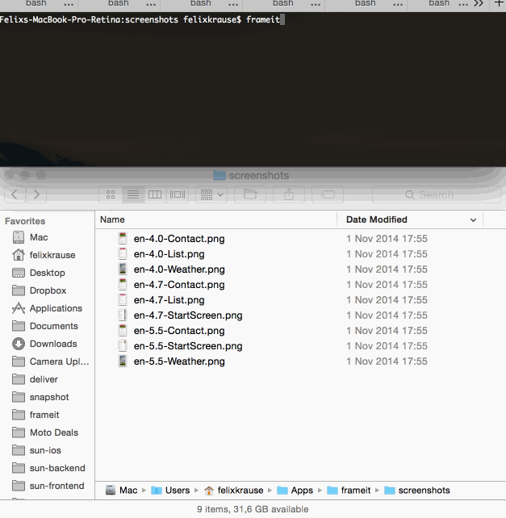

<h3 align="center">
  <a href="https://github.com/KrauseFx/fastlane">
    
    <br />
    fastlane
  </a>
</h3>
<p align="center">
  <a href="https://github.com/KrauseFx/deliver">deliver</a> &bull; 
  <a href="https://github.com/KrauseFx/snapshot">snapshot</a> &bull; 
  <b>frameit</b> &bull; 
  <a href="https://github.com/KrauseFx/PEM">PEM</a> &bull; 
  <a href="https://github.com/KrauseFx/sigh">sigh</a>
</p>
-------

<p align="center">
    
</p>

frameit
============

[](https://twitter.com/KrauseFx)
[](https://github.com/KrauseFx/frameit/blob/master/LICENSE)
[](http://rubygems.org/gems/frameit)

###### Quickly put your screenshots into the right device frames

This tool is not supposed to be used for App Store screenshots. Instead it should be used to prepare screenshots for websites, emails and prints.

Get in contact with the developer on Twitter: [@KrauseFx](https://twitter.com/KrauseFx)


-------
<p align="center">
    <a href="#features">Features</a> &bull; 
    <a href="#installation">Installation</a> &bull; 
    <a href="#usage">Usage</a> &bull; 
    <a href="#tips">Tips</a> &bull; 
    <a href="#need-help">Need help?</a>
</p>

-------
<h5 align="center"><code>frameit</code> is part of <a href="http://fastlane.tools">fastlane</a>: connect all deployment tools into one streamlined workflow.</h5>


# Features

Put a gorgeous device frame around your iOS screenshots just by running one simple command. Support for:
- iPhone 6 Plus, iPhone 6, iPhone 5s and iPad Mini
- Portrait and Landscape
- Black and Silver devices

Here is a nice gif, that shows ```frameit``` in action:



Here is how the result can look like


# Installation

Make sure, you have the commandline tools installed

    xcode-select --install

Install the gem

    sudo gem install frameit

Because of legal reasons, I can not pre-package the device frames with ```frameit```.

The process of adding is really easy, just run ```frameit``` and the guide will help you set it up.
You only have to do this once per computer.

- Run ```frameit```
- Press ```Enter```. The [Apple page](https://developer.apple.com/app-store/marketing/guidelines/#images) to download the images should open in your browser.
- Download the devices you want to use
- Press ```Enter```
- Unzip and move the content of the zip files to ```~/.frameit/device_frames```
- Press ```Enter```
  
# Usage

Why should you have to use Photoshop, just to add a frame around your screenshots?

Just navigate to your folder of screenshots and use the following command:

    frameit

To use the silver version of the frames:

    frameit silver
    
To run the setup process again to add new frames use:

    frameit setup

# Tips

## [`fastlane`](http://fastlane.tools) Toolchain

- [`fastlane`](http://fastlane.tools): Connect all deployment tools into one streamlined workflow
- [`deliver`](https://github.com/KrauseFx/deliver): Upload screenshots, metadata and your app to the App Store using a single command
- [`snapshot`](https://github.com/KrauseFx/snapshot): Automate taking localized screenshots of your iOS app on every device
- [`PEM`](https://github.com/KrauseFx/pem): Automatically generate and renew your push notification profiles
- [`sigh`](https://github.com/KrauseFx/sigh): Because you would rather spend your time building stuff than fighting provisioning

## Generate screenshots
Check out [```Snapshot```](https://github.com/KrauseFx/snapshot) to automatically generate screenshots using ```UI Automation```.

## Use a clean status bar
You can use [SimulatorStatusMagic](https://github.com/shinydevelopment/SimulatorStatusMagic) to clean up the status bar.

## Uninstall
- ```sudo gem uninstall frameit```
- ```rm -rf ~/.frameit```

# Need help?
- If there is a technical problem with ```frameit```, submit an issue. Run ```frameit --trace``` to get the stacktrace.
- I'm available for contract work - drop me an email: frameit@krausefx.com

# License
This project is licensed under the terms of the MIT license. See the LICENSE file.

# Contributing

1. Create an issue to discuss about your idea
2. Fork it (https://github.com/KrauseFx/frameit/fork)
3. Create your feature branch (`git checkout -b my-new-feature`)
4. Commit your changes (`git commit -am 'Add some feature'`)
5. Push to the branch (`git push origin my-new-feature`)
6. Create a new Pull Request
