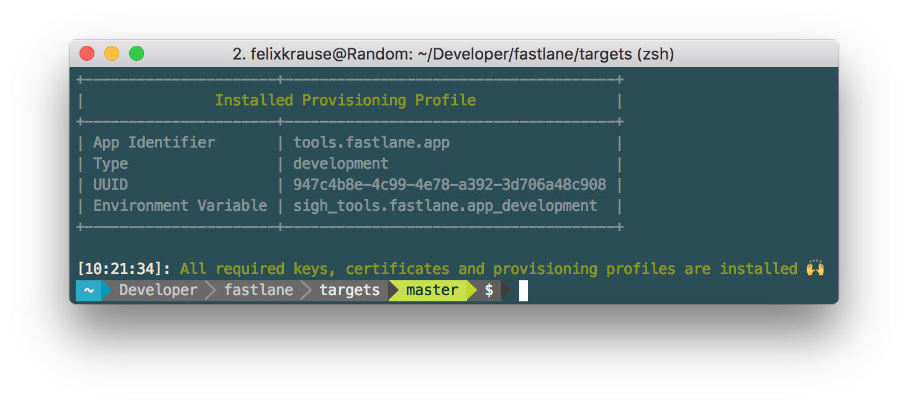

<h3 align="center">
  <a href="https://github.com/fastlane/fastlane">
    
    <br />
    fastlane
  </a>
</h3>


fastfix
============

[](https://twitter.com/KrauseFx)
[](https://github.com/fastlane/fastfix/blob/master/LICENSE)

-------
<p align="center">
    <a href="#why">Why?</a> &bull; 
    <a href="#installation">Installation</a> &bull; 
    <a href="#usage">Usage</a> &bull; 
    <a href="#how-does-it-work">How does it work?</a> &bull; 
    <a href="#tips">Tips</a> &bull; 
    <a href="#need-help">Need help?</a>
</p>

-------

<h5 align="center"><code>fastfix</code> is part of <a href="https://fastlane.tools">fastlane</a>: connect all deployment tools into one streamlined workflow.</h5>

## Why fastfix?

TODO

### Why not let Xcode handle all this

- You have full control over what happens
- You have access to all the certificates and profiles, which are all securely stored in git
- Xcode sometimes revokes your certificates
- TODO

## Installation

```
sudo gem install fastfix
```

Make sure, you have the latest version of the Xcode command line tools installed:

    xcode-select --install

## Usage

### Setup

Create a new private git repo and run

```
fastfix init
```

You'll be asked to enter the URL to your git repo. This can be either a `https://` or a `git://` URL. 

### Run

Add `fastfix` to your `Fastfile` (part of [fastlane](https://fastlane.tools))

```ruby
fastfix(type: "appstore")

fastfix(git_url: "https://github.com/fastlane/certificates", type: "development")

fastfix(git_url: "https://github.com/fastlane/certificates", type: "adhoc", app_identifier: "tools.fastlane.app")
```

### Nuke

If you never cared about code signing and have a completely messy Apple Developer account with a lot of invalid, expired or Xcode managed profiles and certificates, you should use the `fastfix nuke` command.

To revoke all certificates and provisioning profiles for a specific environment.

```sh
fastfix nuke development
fastfix nuke adhoc
fastfix nuke appstore
```

You'll have to confirm a list of profiles / certificates that will be deleted.

## Setup Xcode project

To make sure Xcode is using the right provisioning profile for each target, don't use the `Automatic` feature for the profile selection.

`fastfix` automatically pre-fills environment variables with the UUIDs of the correct provisioning profiles, ready to be used in your Xcode project. 



Open your target settings, open the dropdown for `Provisioning Profile` and select `Other`. 

```
$(sigh_tools.fastlane.app_development)
# in general
$(sigh_[bundle.identifier].[distributiontype])
```


# Need help?
Please submit an issue on GitHub and provide information about your setup

# License
This project is licensed under the terms of the MIT license. See the LICENSE file.

> This project and all fastlane tools are in no way affiliated with Apple Inc. This project is open source under the MIT license, which means you have full access to the source code and can modify it to fit your own needs. All fastlane tools run on your own computer or server, so your credentials or other sensitive information will never leave your own computer. You are responsible for how you use fastlane tools.
