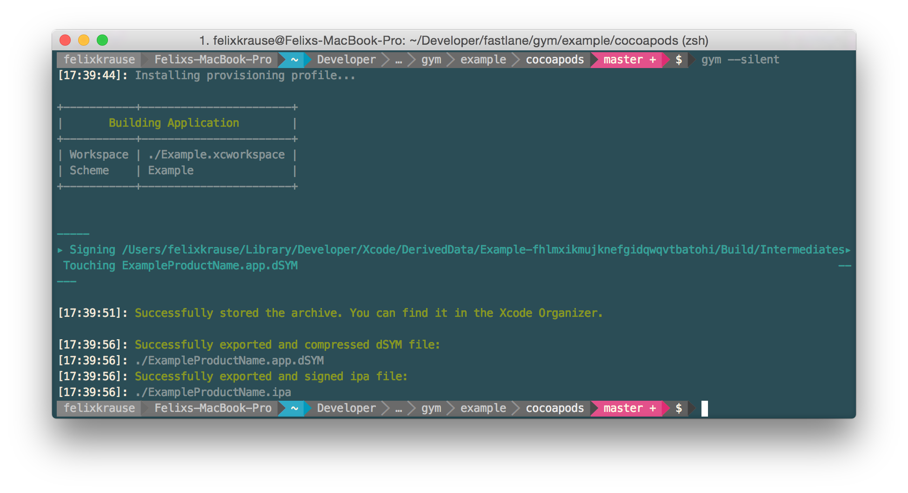
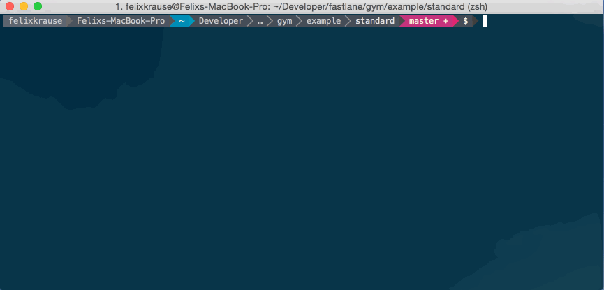

<h3 align="center">
  <a href="https://github.com/fastlane/fastlane/tree/master/fastlane">
    
    <br />
    fastlane
  </a>
</h3>
<p align="center">
  <a href="https://github.com/fastlane/fastlane/tree/master/deliver">deliver</a> &bull; 
  <a href="https://github.com/fastlane/fastlane/tree/master/snapshot">snapshot</a> &bull; 
  <a href="https://github.com/fastlane/fastlane/tree/master/frameit">frameit</a> &bull; 
  <a href="https://github.com/fastlane/fastlane/tree/master/pem">pem</a> &bull; 
  <a href="https://github.com/fastlane/fastlane/tree/master/sigh">sigh</a> &bull; 
  <a href="https://github.com/fastlane/fastlane/tree/master/produce">produce</a> &bull;
  <a href="https://github.com/fastlane/fastlane/tree/master/cert">cert</a> &bull;
  <a href="https://github.com/fastlane/fastlane/tree/master/spaceship">spaceship</a> &bull;
  <a href="https://github.com/fastlane/fastlane/tree/master/pilot">pilot</a> &bull;
  <a href="https://github.com/fastlane/boarding">boarding</a> &bull;
  <b>gym</b> &bull;
  <a href="https://github.com/fastlane/fastlane/tree/master/scan">scan</a> &bull;
  <a href="https://github.com/fastlane/fastlane/tree/master/match">match</a>
</p>
-------

<p align="center">
  
</p>

gym
============

[](https://twitter.com/FastlaneTools)
[](https://github.com/fastlane/fastlane/blob/master/LICENSE)
[](http://rubygems.org/gems/gym)
[](https://circleci.com/gh/fastlane/fastlane)

###### Building your app has never been easier

Get in contact with the developer on Twitter: [@FastlaneTools](https://twitter.com/FastlaneTools)

-------
<p align="center">
    <a href="#whats-gym">Features</a> &bull; 
    <a href="#installation">Installation</a> &bull; 
    <a href="#usage">Usage</a> &bull; 
    <a href="#tips">Tips</a> &bull; 
    <a href="#need-help">Need help?</a>
</p>

-------

<h5 align="center"><code>gym</code> is part of <a href="https://fastlane.tools">fastlane</a>: connect all deployment tools into one streamlined workflow.</h5>

# What's gym?

`gym` builds and packages iOS apps for you. It takes care of all the heavy lifting and makes it super easy to generate a signed `ipa` file :muscle:

`gym` is a replacement for [shenzhen](https://github.com/nomad/shenzhen).

### Before `gym`

```
xcodebuild clean archive -archivePath build/MyApp \
                         -scheme MyApp
xcodebuild -exportArchive \
           -exportFormat ipa \
           -archivePath "build/MyApp.xcarchive" \
           -exportPath "build/MyApp.ipa" \
           -exportProvisioningProfile "ProvisioningProfileName" 
```

### With `gym`

```
gym
```

### Why `gym`?

`gym` uses the latest APIs to build and sign your application which results in much faster build times.

              |  Gym Features
--------------------------|------------------------------------------------------------
:rocket:            | `gym` builds 30% faster than other build tools like [shenzhen](https://github.com/nomad/shenzhen)
:checkered_flag: | Beautiful inline build output
:book:     | Helps you resolve common build errors like code signing issues
:mountain_cableway: | Sensible defaults: Automatically detect the project, its schemes and more
:link:  | Works perfectly with [fastlane](https://fastlane.tools) and other tools
:package: | Automatically generates an `ipa` and a compressed `dSYM` file
:bullettrain_side: | Don't remember any complicated build commands, just `gym`
:wrench:  | Easy and dynamic configuration using parameters and environment variables
:floppy_disk:   | Store common build settings in a `Gymfile` 
:outbox_tray: | All archives are stored and accessible in the Xcode Organizer
:computer: | Supports both iOS and Mac applications



-----



# Installation

    sudo gem install gym

Make sure, you have the latest version of the Xcode command line tools installed:

    xcode-select --install

# Usage

    gym

That's all you need to build your application. If you want more control, here are some available parameters:

    gym --workspace "Example.xcworkspace" --scheme "AppName" --clean

If you need to use a different xcode install, use xcode-select or define DEVELOPER_DIR:

    DEVELOPER_DIR="/Applications/Xcode6.2.app" gym

For a list of all available parameters use

    gym --help

If you run into any issues, use the `verbose` mode to get more information

    gym --verbose

In general, if you run into issues while exporting the archive, try using:

    gym --use_legacy_build_api

Set the right export method if you're not uploading to App Store or TestFlight:

    gym --export_method ad-hoc

To pass boolean parameters make sure to use `gym` like this:

    gym --include_bitcode true --include_symbols false

To access the raw `xcodebuild` output open `~/Library/Logs/gym`

# Gymfile

Since you might want to manually trigger a new build but don't want to specify all the parameters every time, you can store your defaults in a so called `Gymfile`.

Run `gym init` to create a new configuration file. Example:

```ruby
scheme "Example"

sdk "iphoneos9.0"

clean true

output_directory "./build"    # store the ipa in this folder
output_name "MyApp"           # the name of the ipa file
```

## Export options

Since Xcode 7, `gym` is using new Xcode API which allows us to specify export options using `plist` file. By default `gym` creates this file for you and you are able to modify some parameters by using `export_method`, `export_team_id`, `include_symbols` or `include_bitcode`. If you want to have more options, like creating manifest file or app thinning, you can provide your own `plist` file:

```ruby
export_options "./ExportOptions.plist"
```

or you can provide hash of values directly in the `Gymfile`:

```ruby
export_options(
  method: "ad-hoc",
  manifest: {
    appURL: "https://example.com/My App.ipa",
  },
  thinning: "<thin-for-all-variants>"
)
```

For the list of available options run `xcodebuild -help`.

# Automating the whole process

`gym` works great together with [fastlane](https://fastlane.tools), which connects all deployment tools into one streamlined workflow. 

Using `fastlane` you can define a configuration like

```ruby
lane :beta do
  xctool
  gym(scheme: "MyApp")
  crashlytics
end
```

You can then easily switch between the beta provider (e.g. `testflight`, `hockey`, `s3` and more).

For more information visit the [fastlane GitHub page](https://github.com/fastlane/fastlane/tree/master/fastlane).

# How does it work?

`gym` uses the latest APIs to build and sign your application. The 2 main components are 

- `xcodebuild` 
- [xcpretty](https://github.com/supermarin/xcpretty)

When you run `gym` without the `--silent` mode it will print out every command it executes.

To build the archive `gym` uses the following command:

```
set -o pipefail && \
xcodebuild -scheme 'Example' \
-project './Example.xcodeproj' \
-configuration 'Release' \
-destination 'generic/platform=iOS' \
-archivePath '/Users/felixkrause/Library/Developer/Xcode/Archives/2015-08-11/ExampleProductName 2015-08-11 18.15.30.xcarchive' \
archive | xcpretty
```

After building the archive it is being checked by `gym`. If it's valid, it gets packaged up and signed into an `ipa` file.

`gym` automatically chooses a different packaging method depending on the version of Xcode you're using.

### Xcode 7 and above

```
/usr/bin/xcrun path/to/xcbuild-safe.sh -exportArchive \
-exportOptionsPlist '/tmp/gym_config_1442852529.plist' \
-archivePath '/Users/fkrause/Library/Developer/Xcode/Archives/2015-09-21/App 2015-09-21 09.21.56.xcarchive' \
-exportPath '/tmp/1442852529'
```

`gym` makes use of the new Xcode 7 API which allows us to specify the export options using a `plist` file. You can find more information about the available options by running `xcodebuild --help`.

Using this method there are no workarounds for WatchKit or Swift required, as it uses the same technique Xcode uses when exporting your binary.

Note: the [xcbuild-safe.sh script](https://github.com/fastlane/fastlane/tree/master/gym/lib/assets/wrap_xcodebuild/xcbuild-safe.sh) wraps around xcodebuild to workaround some incompatibilities.

### Xcode 6 and below

```
/usr/bin/xcrun /path/to/PackageApplication4Gym -v \
'/Users/felixkrause/Library/Developer/Xcode/Archives/2015-08-11/ExampleProductName 2015-08-11 18.15.30.xcarchive/Products/Applications/name.app' -o \
'/Users/felixkrause/Library/Developer/Xcode/Archives/2015-08-11/ExampleProductName.ipa' \ 
--sign "identity" --embed "provProfile"
```

Note: the official PackageApplication script is replaced by a custom PackageApplication4Gym script. This script is obtained by applying a [set of patches](https://github.com/fastlane/fastlane/tree/master/gym/lib/assets/package_application_patches) on the fly to fix some known issues in the official Xcode PackageApplication script.

Afterwards the `ipa` file is moved to the output folder. The `dSYM` file is compressed and moved to the output folder as well.

# Tips
## [`fastlane`](https://fastlane.tools) Toolchain

- [`fastlane`](https://fastlane.tools): Connect all deployment tools into one streamlined workflow
- [`deliver`](https://github.com/fastlane/fastlane/tree/master/deliver): Upload screenshots, metadata and your app to the App Store
- [`snapshot`](https://github.com/fastlane/fastlane/tree/master/snapshot): Automate taking localized screenshots of your iOS app on every device
- [`frameit`](https://github.com/fastlane/fastlane/tree/master/frameit): Quickly put your screenshots into the right device frames
- [`pem`](https://github.com/fastlane/fastlane/tree/master/pem): Automatically generate and renew your push notification profiles
- [`produce`](https://github.com/fastlane/fastlane/tree/master/produce): Create new iOS apps on iTunes Connect and Dev Portal using the command line
- [`cert`](https://github.com/fastlane/fastlane/tree/master/cert): Automatically create and maintain iOS code signing certificates
- [`spaceship`](https://github.com/fastlane/fastlane/tree/master/spaceship): Ruby library to access the Apple Dev Center and iTunes Connect
- [`pilot`](https://github.com/fastlane/fastlane/tree/master/pilot): The best way to manage your TestFlight testers and builds from your terminal
- [`boarding`](https://github.com/fastlane/boarding): The easiest way to invite your TestFlight beta testers 
- [`scan`](https://github.com/fastlane/fastlane/tree/master/scan): The easiest way to run tests of your iOS and Mac app
- [`match`](https://github.com/fastlane/fastlane/tree/master/match): Easily sync your certificates and profiles across your team using git

##### [Like this tool? Be the first to know about updates and new fastlane tools](https://tinyletter.com/krausefx)

## Use the 'Provisioning Quicklook plugin'
Download and install the [Provisioning Plugin](https://github.com/chockenberry/Provisioning).

# Need help?
Please submit an issue on GitHub and provide information about your setup

# Code of Conduct
Help us keep `gym` open and inclusive. Please read and follow our [Code of Conduct](https://github.com/fastlane/fastlane/CODE_OF_CONDUCT.md).

# License
This project is licensed under the terms of the MIT license. See the LICENSE file.

> This project and all fastlane tools are in no way affiliated with Apple Inc. This project is open source under the MIT license, which means you have full access to the source code and can modify it to fit your own needs. All fastlane tools run on your own computer or server, so your credentials or other sensitive information will never leave your own computer. You are responsible for how you use fastlane tools.
